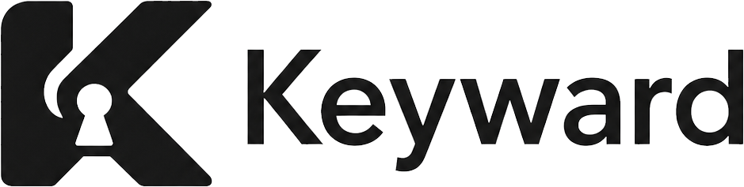

# Keyward

<p align="center">
  
</p>

[](https://github.com/playup/keyward/actions/workflows/ci.yml)
[](https://github.com/playup/keyward/actions/workflows/codeql.yml)

Keyward is a zero-trust SSH access platform for replacing long-lived user SSH keys with device-bound authentication and short-lived OpenSSH user certificates.

Users connect with normal SSH tooling, but the credential they use is issued just in time after the local device client proves device possession, optional user presence, and current authorization. Servers validate certificates locally with standard OpenSSH `TrustedUserCAKeys` and reject revoked certificates through OpenSSH KRLs.

The target access model is:

```text
User identity + trusted device + policy decision + short-lived SSH certificate
```

instead of:

```text
User + static SSH private key
```

## Why

Traditional SSH key access is difficult to govern at enterprise scale:

- private keys are copied, exported, forgotten, and rarely rotated
- revocation is slow and inconsistent across servers
- access is often granted directly on hosts instead of through central policy
- auditing usually shows a Unix account, not the user, device, policy, and approval path
- emergency access removal is hard when certificates or keys remain valid on endpoints

This project keeps the server-side SSH path OpenSSH-native while moving access decisions into a central platform.

## Core Features

- Short-lived OpenSSH user certificates
- Device enrollment and trust lifecycle
- Local desktop client with SSH-agent-compatible behavior
- Windows Hello / local user presence policy support
- Central user, group, server, device, policy, and grant management
- Local admin login plus OIDC and SAML identity provider integration
- SAML group synchronization support, including Microsoft Entra ID group IDs
- Server enrollment and OpenSSH configuration sync
- Revocation through scoped OpenSSH KRL files
- Continuous server-agent watch mode for near-real-time revocation
- Audit events for issuance, denial, revocation, enrollment, and admin actions
- Cross-platform Go builds for Windows, macOS, and Linux
- GitHub Actions CI, CodeQL scanning, Dependabot, and release packaging

## Architecture

The system has three main components.

### Web Platform

Location: `platform/`

The Flask platform is the control plane. It manages:

- authentication and local admin login
- users, groups, roles, and role bindings
- OIDC and SAML identity provider settings
- device enrollment and inventory
- server enrollment
- access grants
- conditional access policies
- SSH certificate issuance
- revocation state
- audit logging
- admin and user-facing web UI

The platform signs OpenSSH user certificates using a configured SSH user CA.

### Device Client

Location: `agents/device-client/`

The device client runs on the user's workstation. It provides:

- device enrollment through browser login approval
- local device identity key management
- local user presence checks where policy requires them
- automatic access sync
- automatic short-lived certificate issuance and refresh
- SSH-agent-compatible serving for OpenSSH
- Windows named pipe support
- desktop tray application

The current implementation stores development device material under `~/.keyward-ssh/`. Production deployments should move device identity into hardware-backed or OS-protected storage such as TPM, Secure Enclave, Windows Hello, CNG KSP, FIDO2, or managed platform authenticators.

### Server Agent

Location: `agents/server-agent/`

The server agent runs on SSH servers. It provides:

- server enrollment
- trusted SSH user CA synchronization
- OpenSSH include config rendering
- KRL generation for revoked active certificates
- continuous revocation watch mode
- diagnostics for effective SSH config and KRL checks

The server agent does not sit in the hot SSH authentication path. OpenSSH validates certificates locally, which keeps login latency low and avoids a hard dependency on platform availability during every SSH connection.

## SSH Login Flow

```text
User runs ssh
    |
    v
Local Keyward SSH agent receives identity request
    |
    v
Client checks local state and optional user presence
    |
    v
Client signs a certificate request with its enrolled device key
    |
    v
Platform verifies device, user, nonce, server, access grant, and policy
    |
    v
Platform signs an ephemeral OpenSSH user certificate
    |
    v
Local agent offers the certificate to ssh
    |
    v
OpenSSH server validates TrustedUserCAKeys and RevokedKeys
```

The user still runs ordinary commands such as:

```bash
ssh alice@server.example.com
```

The difference is that the SSH credential is fresh, device-bound, policy-aware, auditable, and centrally revocable.

## Revocation Model

The platform records every certificate issuance with its serial, user, device, server, principal, policy decision, and validity window.

When access changes, the platform exposes only currently valid certificate serials that should now be rejected. The server agent fetches this state and regenerates an OpenSSH KRL:

```text
/etc/ssh/keyward/revoked.krl
```

The generated OpenSSH include looks like:

```text
TrustedUserCAKeys /etc/ssh/keyward/trusted_user_ca.pub
RevokedKeys /etc/ssh/keyward/revoked.krl
```

KRL state is intentionally bounded:

- expired certificates are not included
- KRL files are regenerated from current platform state, not appended forever
- server agents send their server ID so each host receives only relevant revoked serials
- short certificate TTLs keep the emergency revocation window small

Run continuous revocation sync on servers:

```bash
keyward-server-agent watch --interval 2s
```

## Repository Layout

```text
.
|-- .github/workflows       GitHub Actions CI, CodeQL, release workflows
|-- agents
|   |-- device-client       Go desktop client, local SSH agent, tray app
|   `-- server-agent        Go SSH server enrollment and KRL sync agent
|-- deploy
|   |-- docker-compose.yml  Local development dependencies
|   |-- openssh             OpenSSH helper config and dev CA script
|   `-- systemd             Example server-agent unit
|-- platform                Flask web platform and API
|-- proto                   Protocol definitions
`-- scripts                 Cross-platform build scripts
```

## Local Development

### Requirements

- Python 3.11+
- Go 1.25 for the device client module
- Go 1.22+ for the server agent module
- OpenSSH client/server tools
- Docker, if using the provided development services

### Start Dependencies

```bash
docker compose -f deploy/docker-compose.yml up -d
```

### Set Up The Platform

```bash
cd platform
python -m venv venv
. venv/bin/activate
pip install -r requirements-dev.txt
flask --app wsgi:app init-db
```

Create a development SSH user CA:

```bash
cd ..
sh deploy/openssh/create-dev-ca.sh
```

Run the platform:

```bash
cd platform
flask --app wsgi:app run
```

The platform defaults to SQLite for development. Use `DB_BACKEND=postgres` or `DATABASE_URL=...` to use PostgreSQL.

### Create An Admin

```bash
cd platform
flask --app wsgi:app create-admin --email admin@example.com
```

Open:

```text
http://127.0.0.1:5000/login
```

The user portal is available at:

```text
http://127.0.0.1:5000/
```

## Enroll A Server

Configure the server agent:

```bash
cd agents/server-agent
go run ./cmd/keyward-server-agent configure --platform-url http://127.0.0.1:5000
```

Create an enrollment token in the admin UI:

```text
Admin -> Servers -> New Enrollment Token
```

Use an exact hostname for one server, or a wildcard hostname pattern such as `prod-web-*` for a golden image or VM template rollout. Restrict the token with a short TTL, low max-use count, and allowed source CIDRs. Copy the raw token immediately; it is shown only once. On the server or template, store it in a root-readable file:

```bash
sudo install -m 0600 /dev/null /etc/keyward-server-agent/enrollment.token
sudo sh -c 'printf "%s\n" "<token>" > /etc/keyward-server-agent/enrollment.token'
```

Redeem the token from that file. The agent sends the operating system hostname by default, or provisioning can pass an explicit name:

```bash
go run ./cmd/keyward-server-agent enroll --token-file /etc/keyward-server-agent/enrollment.token
go run ./cmd/keyward-server-agent enroll --token-file /etc/keyward-server-agent/enrollment.token --hostname "$(hostname -f)"
```

Run one sync:

```bash
go run ./cmd/keyward-server-agent sync
```

For continuous revocation enforcement:

```bash
go run ./cmd/keyward-server-agent watch --interval 2s
```

For local development without writing to `/etc`, configure custom paths:

```bash
export KEYWARD_SERVER_AGENT_CONFIG=/tmp/keyward-server-agent/config.json

go run ./cmd/keyward-server-agent configure \
  --platform-url http://127.0.0.1:5000 \
  --state-dir /tmp/keyward-server-agent \
  --trusted-user-ca /tmp/keyward-server-agent/trusted_user_ca.pub \
  --sshd-include /tmp/keyward-server-agent/keyward.conf \
  --revocation-state /tmp/keyward-server-agent/revocation-state.json \
  --revoked-keys /tmp/keyward-server-agent/revoked.krl
```

## Enroll A Device

Configure the client:

```bash
cd agents/device-client
go run ./cmd/keyward-agent configure --platform-url http://127.0.0.1:5000
```

Enroll the device:

```bash
go run ./cmd/keyward-agent enroll \
  --name alice-laptop \
  --platform linux
```

The client opens or prints a browser approval URL. The user logs into the platform, approves the device enrollment, and the client completes enrollment by signing the platform challenge.

Device approval is step-up protected. Local users must re-enter their password before trusting a new device. Federated users must have a recent SSO session, otherwise they need to sign out and sign in again before approval.

The desktop tray app can run the same client behavior as a background application:

```bash
go run ./cmd/keyward-tray
```

## Grant Access

In the admin UI, create an access grant:

```text
Admin -> Policies & Grants
```

An access grant maps:

- a user or group
- to a server, server group, or all servers
- with one or more Unix principals, such as `alice`, `deploy`, or `root`

Policies can further restrict access by:

- device trust status
- server environment
- server tags
- SSH principal
- source IP
- certificate TTL
- user presence requirements
- SSH certificate options and extensions

## Connect With SSH

Start the local agent:

```bash
cd agents/device-client
go run ./cmd/keyward-agent serve
```

The agent syncs access and refreshes short-lived certificates automatically.

Manual certificate issuance is available for debugging:

```bash
go run ./cmd/keyward-agent issue-cert \
  --server dev-server-01 \
  --principal alice \
  --identity ~/.keyward-ssh/dev-server-01
```

Then connect:

```bash
ssh -i ~/.keyward-ssh/dev-server-01 alice@dev-server-01
```

When using the agent flow, point SSH at the configured agent socket or pipe.

Windows fallback when another agent owns the default OpenSSH pipe:

```text
Host *
  IdentityAgent \\.\pipe\keyward-agent
```

Then run:

```powershell
keyward-agent serve --socket \\.\pipe\keyward-agent
```

## User Presence

Policies can require local user presence before a certificate-backed SSH login is allowed.

Configure presence mode:

```bash
keyward-agent configure --presence-mode auto
```

Supported modes:

```text
auto            Windows Hello on Windows, local confirmation on macOS
windows_hello   Windows WebAuthn platform authenticator / Windows Hello
macos_touchid   macOS local confirmation prompt
yubikey         custom command hook for YubiKey/FIDO tooling
command         custom command hook
none            disable local presence checks on the client
```

On Windows, the client uses the Win32 WebAuthn API directly. The first SSH login that requires presence enrolls a local platform credential in Windows Hello and stores only the credential handle. Later SSH logins request a WebAuthn assertion with user verification required, allowing Windows Hello to satisfy policy with PIN, fingerprint, face unlock, or another configured platform factor.

Custom command mode receives the reason in `KEYWARD_SSH_REASON` and must exit with status `0` to approve:

```bash
keyward-agent configure \
  --presence-mode command \
  --presence-command 'ykman oath accounts code ssh-login >/dev/null'
```

Presence checks are cached briefly to avoid multiple prompts during one SSH handshake:

```bash
keyward-agent configure --presence-cache-seconds 30
```

## Identity Providers

OIDC and SAML settings are managed in:

```text
Admin -> Settings -> Identity Provider Integrations
```

For Microsoft Entra ID OIDC, use a Web redirect URI:

```text
https://<platform-host>/oidc/callback
```

Typical settings:

```text
Issuer URL: https://login.microsoftonline.com/<tenant-id>/v2.0
Client ID: <application client id>
Client Secret: <client secret value>
Scopes: openid email profile
Email Claim: preferred_username
Name Claim: name
Groups Claim: groups
Allowed Tenant ID: <tenant-id>
```

For SAML, use the platform metadata and ACS URLs shown in the settings page:

```text
SP Metadata: https://<platform-host>/saml/metadata
ACS URL:     https://<platform-host>/saml/acs
```

Federated logins create or update users automatically, enforce `ALLOWED_LOGIN_DOMAINS`, and can sync incoming group claims into platform groups for policy assignment.

## Build

Build all Go agents for Linux, macOS, and Windows:

```bash
./scripts/build-go.sh
```

Build selected targets:

```bash
./scripts/build-go.sh linux/amd64 darwin/arm64 windows/amd64
```

From PowerShell:

```powershell
pwsh ./scripts/build-go.ps1
```

Artifacts are written to:

```text
dist/go/<os>-<arch>/
```

The build scripts pass `-buildvcs=false` so Go does not fail when the source tree has no usable Git metadata.

## Test

Run platform checks:

```bash
cd platform
python -m compileall app tests wsgi.py
python -m ruff check app tests wsgi.py
python -m pytest
```

Run Go tests:

```bash
cd agents/device-client
go test ./...

cd ../server-agent
go test ./...
```

## CI/CD

GitHub Actions workflows are included:

- `CI`: Python lint/test/compile, Go tests, and cross-platform Go builds
- `CodeQL`: Python and Go security analysis
- `Release`: builds release artifacts on `v*` tags
- `Dependabot`: dependency update PRs for Actions, Python, and Go modules

Create a release:

```bash
git tag v0.1.0
git push origin v0.1.0
```

The release workflow publishes archives and `SHA256SUMS`.

## Operational Notes

Install the server-agent as a system service:

```bash
sudo cp keyward-server-agent /usr/local/bin/keyward-server-agent
sudo cp deploy/systemd/keyward-server-agent.service /etc/systemd/system/keyward-server-agent.service
sudo systemctl daemon-reload
sudo systemctl enable --now keyward-server-agent
```

Reload `sshd` after `RevokedKeys` is added to config for the first time:

```bash
sudo systemctl reload sshd
```

Inspect KRL contents:

```bash
ssh-keygen -Q -l -f /etc/ssh/keyward/revoked.krl
```

Verify a certificate against the configured KRL:

```bash
keyward-server-agent verify-revocation --cert /path/to/id_ed25519-cert.pub
```

Inspect effective sshd config:

```bash
sshd -T
```

## Security Status

This repository is an active development implementation, not a turnkey hardened production product yet.

Implemented security foundations include:

- short-lived OpenSSH user certificates
- signed device enrollment challenge
- signed certificate requests
- replay nonce tracking
- device trust state
- central policy checks
- KRL-based server-side revocation
- per-server scoped revocation state
- audit logging
- local user presence policy hooks

Production hardening still recommended:

- protect the SSH CA key with HSM/KMS or an isolated signer
- use hardware-backed non-exportable device keys
- add mTLS between agents and platform
- sign and notarize desktop binaries
- implement signed auto-update
- add database migrations for production lifecycle management
- add SIEM export and alerting
- add SCIM provisioning completion
- add high-availability deployment manifests

## License

License has not been declared yet. Add a license before publishing or accepting external contributions.
